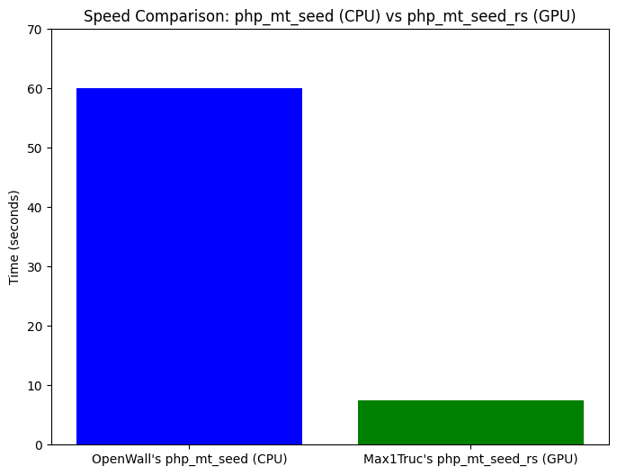

# ```php_mt_seed_rs```

A GPU-accelerated reimplementation of openwall's [php_mt_seed](https://github.com/openwall/php_mt_seed) (PHP 7.1.0+ only).  
It searches for MT19937 seeds that produce given PHP ```mt_rand()``` outputs using a WebGPU (wgpu) compute shader.

8 times faster than the previous state of the art ! The numbers might vary depending on your configuration, but the ratio should stay more or less the same in most cases.



License: MIT OR Apache-2.0

## Features
- Runs the search on the GPU via wgpu/WGSL for large, parallel throughput.
- Supports multiple ```mt_rand()``` outputs and optional ranges per output.
- Prints adapter info and progress while running.

## Requirements
- Rust toolchain (stable).
- A system GPU with compute-shader support and working wgpu backend (Vulkan/Metal/D3D12 as appropriate).

## Build
Build in release mode for best performance:
```bash
cargo build --release
```

## Run
Usage pattern:
```text
php_mt_seed_rs VALUE_OR_MATCH_MIN [MATCH_MAX [RANGE_MIN RANGE_MAX]] ...
```
- You may provide up to 8 matches (one match is ```match_min, match_max, range_min, range_max```).
- Default range is ```0..0x7fffffff``` when omitted.

Examples:
- Single value:
```bash
$ cargo run --release -- 1178568022
    Finished `release` profile [optimized] target(s) in 0.05s
     Running `target/release/php_mt_seed 1178568022`
Running on Adapter: AdapterInfo {
    name: "NVIDIA GeForce GTX 1660 Ti",
    vendor: 4318,
    device: 8593,
    device_type: DiscreteGpu,
    driver: "NVIDIA",
    driver_info: "575.64.05",
    backend: Vulkan,
}
seed = 0x0 = 0 (PHP 7.1.0+)
seed = 0xab2bbe62 = 2871770722 (PHP 7.1.0+)
seed = 0xec3f338f = 3963564943 (PHP 7.1.0+)
seed = 0x6784fafb = 1736768251 (PHP 7.1.0+)
progress: 256 / 256
$ cat > mt_rand.php <<EOF # let's check !
<?php
mt_srand(0);
echo mt_rand() . "\n";
EOF
$ php mt_rand.php # this outputs the correct number
1178568022
```
- Multiple values
```bash
$ cargo r --release -- 0 0 0 0 0 0 0 0 1457 1457 1000 10000 5452 5452 1000 10000 4474 4474 1000 10000
    Finished `release` profile [optimized] target(s) in 0.08s
     Running `target/release/php_mt_seed 0 0 0 0 0 0 0 0 1457 1457 1000 10000 5452 5452 1000 10000 4474 4474 1000 10000`
Running on Adapter: AdapterInfo {
    name: "NVIDIA GeForce GTX 1660 Ti",
    vendor: 4318,
    device: 8593,
    device_type: DiscreteGpu,
    driver: "NVIDIA",
    driver_info: "575.64.05",
    backend: Vulkan,
}
seed = 0x67932 = 424242 (PHP 7.1.0+)
progress: 256 / 256
$ cat > mt_rand.php <<EOF # let's check !
<?php
mt_srand(424242);
mt_rand();
mt_rand();
echo mt_rand(1000, 10000) . "\n";
echo mt_rand(1000, 10000) . "\n";
echo mt_rand(1000, 10000) . "\n";
EOF
$ php mt_rand.php # this outputs the correct numbers
1457
5452
4474
```

## Tests

Unit/integration tests call the GPU prepare/execute code and therefore require a working GPU/wgpu environment. They may fail in environments without a compatible GPU or drivers.

To run tests:
```bash
cargo test
```

## Troubleshooting
- "ERROR: there were many more results than what the GPU could transfer to the CPU" — too many matches; consider using openwall's original ```php_mt_seed``` tool for large result sets.

## Contributing

Contributions and bug reports are welcome — open an issue or PR.

## Thanks

- https://github.com/dcrewi/rust-mersenne-twister
- openwall php_mt_seed: https://github.com/openwall/php_mt_seed ([docs](https://www.openwall.com/php_mt_seed/README))
